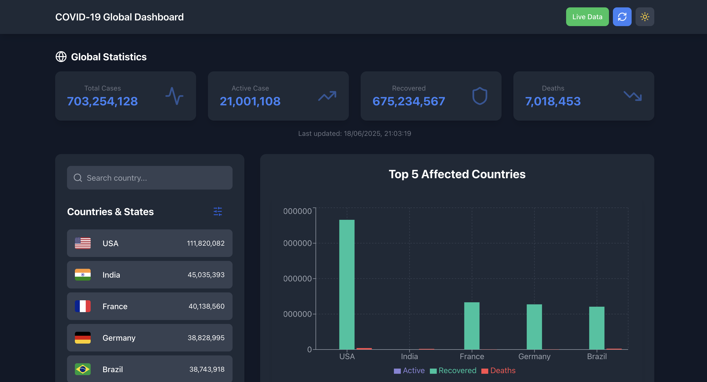
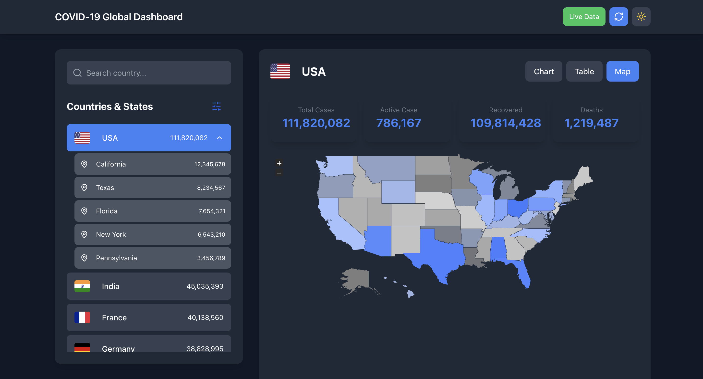
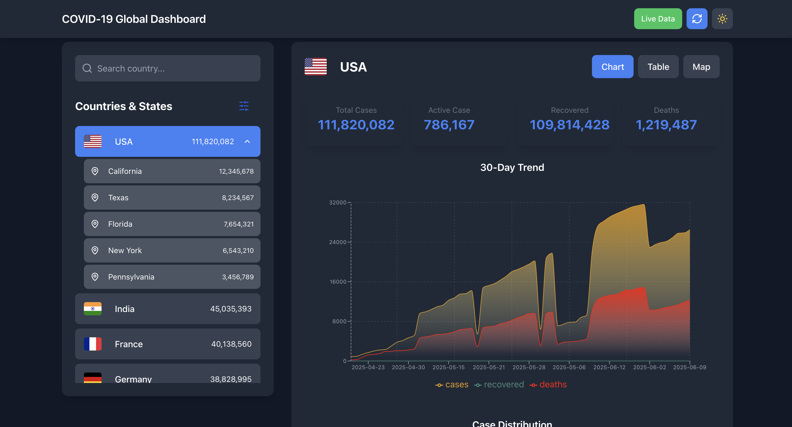
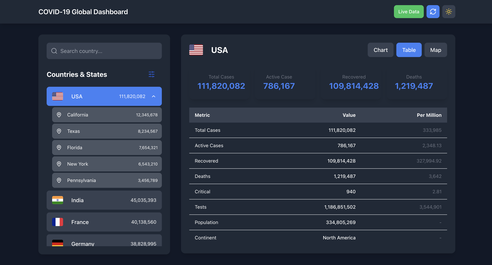
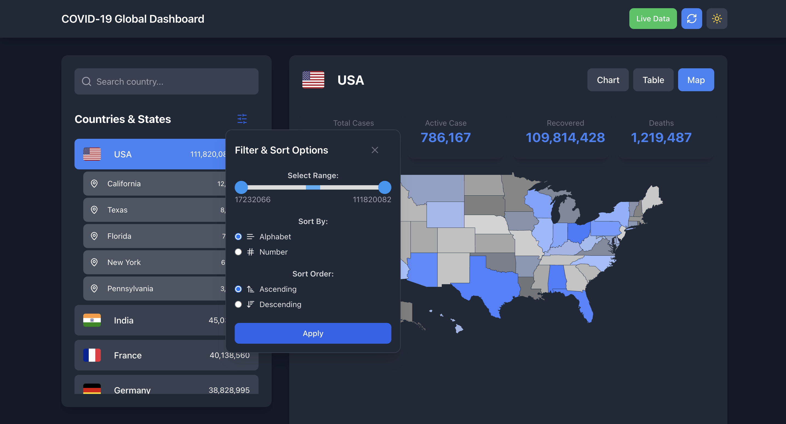

# COVID‑19 Tracker Dashboard

A responsive web app providing real-time COVID‑19 stats, visual graphs, and country-specific data. Explore it at: [https://covid-19-wuzy.onrender.com](https://covid-19-wuzy.onrender.com)

## 🚀 Features
- 🌍 Global and country-specific COVID‑19 statistics
- 📊 Interactive charts for cases, recoveries, and deaths
- 🔍 Country search and filter by case range
- 🌓 Dark/light mode support
- 📱 Fully responsive design
- 🔄 Live data from public APIs or custom backend

## 🛠️ Setup Instructions

1. **Clone the repo**
```bash
git clone https://github.com/igoyadi/Covid_19.git
cd Covid_19
```

2. **Install dependencies (Node.js & npm required)**
```bash
npm install
```

3. **Run locally**
```bash
npm start
```

## 🧰 Tech Stack

- **Frontend**: React.js, Axios, Recharts, Tailwind CSS
- **API**: disease.sh or custom backend
- **Hosting**: Render.com

## 📸 Screenshots

### 🌐 Global Overview


### 📍 Country View


### 📈 Charts & Trends


### 📋 Data Table View


### 🗺️ Map & Filter Options


---

